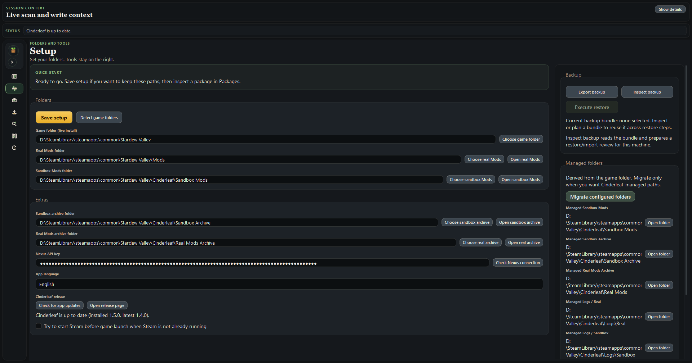
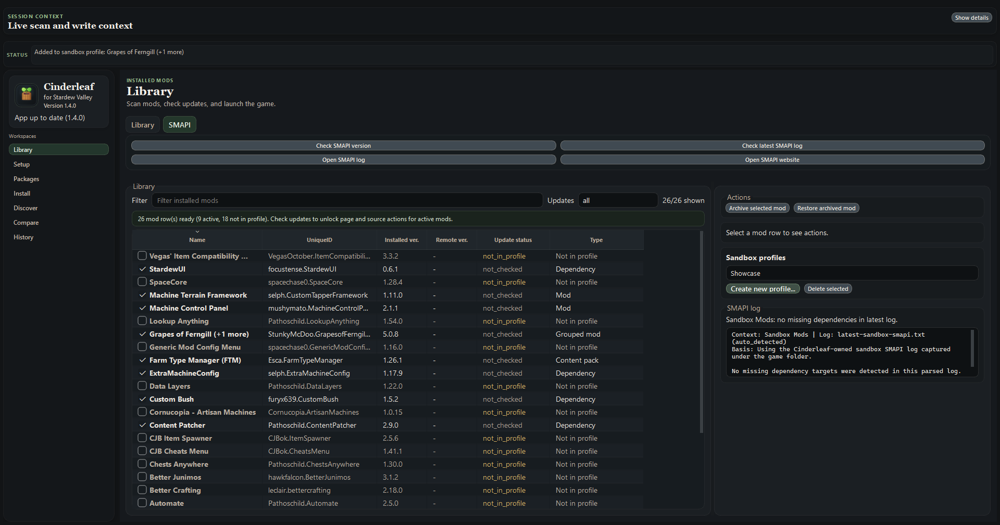
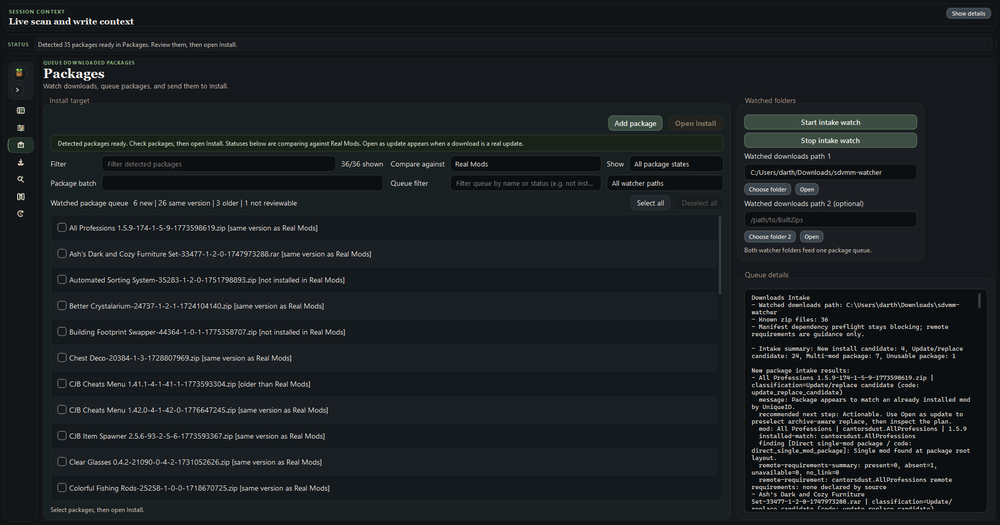
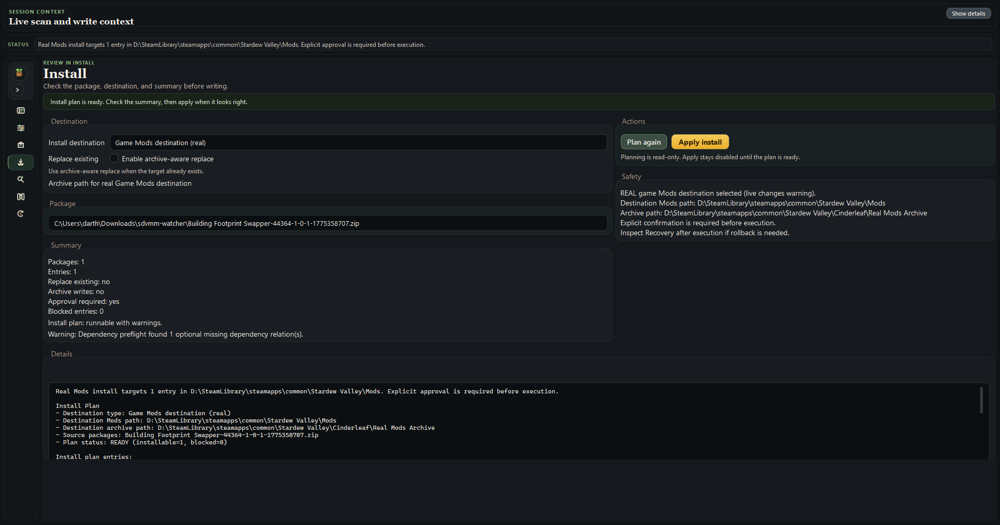
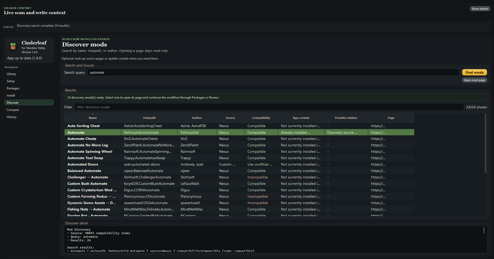
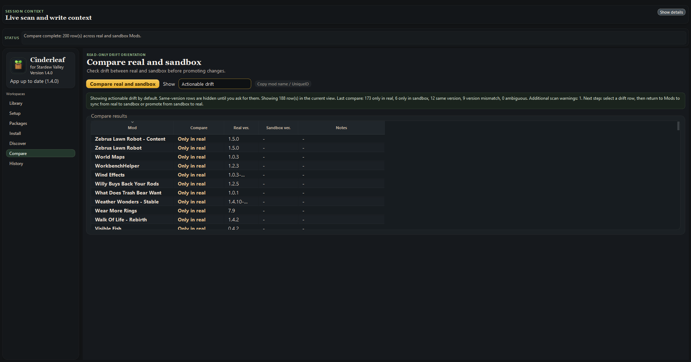
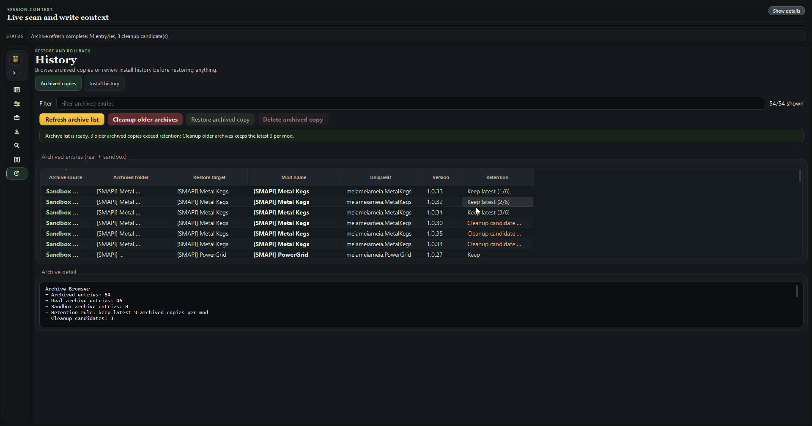

# Cinderleaf

**Cinderleaf** is a Windows-first mod manager for **Stardew Valley**.

It is made for players who want modding to feel simpler:

- keep your mod folders organized
- catch downloaded mod archives in one place
- review installs before anything is changed
- catch missing required dependencies before install writes files
- keep alternate profiles around for different saves or playstyles
- use a sandbox when you want a safer place to test things first
- recover or roll back cleanly if something goes wrong

`for Stardew Valley` is just a description, not an official affiliation. Cinderleaf is a community tool and is not endorsed by ConcernedApe.

Current project version: **1.5.0**

Latest packaged public release: **1.5.0**

If you want the full walkthrough, start with the [User Guide](docs/USER_GUIDE.md).

## What Cinderleaf is good at

Cinderleaf is meant to help with the normal day-to-day modding routine:

- scan what you already have installed
- check for updates
- launch the game or launch with SMAPI
- watch your downloads folder and pick up new archives
- add one package quickly when you do not want to use the watcher
- review installs before writing files
- warn or block when a required dependency is missing during install planning
- count a dependency already staged in the same install batch when that is safe
- compare your real setup and sandbox setup without making Compare a write tool
- auto-add already installed dependencies when you enable a mod in a custom profile
- keep restore, rollback, and backup tools easy to find

The goal is not to bury you in process. The goal is to make the normal flow feel calmer and clearer, while still keeping safer options nearby.

## The main parts of the app

- `Library`: your everyday mod list, update checks, launch actions, profiles, and related actions
- `SMAPI`: SMAPI-specific helpers like version checks, latest log checks, and troubleshooting
- `Packages`: where downloaded archives show up, either through watched folders or `Add package`
- `Install`: the review screen before anything is written, including dependency checks before the write step
- `Discover`: a read-only search area for finding mod pages and sources
- `Compare`: a read-only way to check what is different between real and sandbox
- `History`: archived copies and install rollback history in one place
- `Setup`: folders, backups, restore/import tools, and a few extra configuration options

## Why `1.5.0` matters

This release is a usability release.

The app now feels much more like an everyday mod manager first:

- the main workspaces are calmer and easier to scan
- `Archive` and `Recovery` are now together under `History`
- `Packages` is faster to use, with `Add package`, better watcher handoff, and automatic `Install` opening when the next step is obvious
- dependency handling is more visible in the normal flow, with install planning warnings and smarter profile enabling
- `Compare` shows more rows at once
- the packaged Windows build fixes a watcher issue that could flash a terminal window during RAR intake

For the release history, see [CHANGELOG.md](CHANGELOG.md).

## Download the portable build

The public build is a Windows portable zip on GitHub Releases.

1. Open the repository [Releases page](https://github.com/meiameiameia/Cinderleaf/releases).
2. Download `cinderleaf-1.5.0-windows-portable.zip`.
3. Extract it to a normal folder.
4. Run `Cinderleaf.exe`.

If a checksum file is published with the release, you can verify it against `cinderleaf-1.5.0-windows-portable.zip.sha256`.

Good to know:

- this is a portable folder, not an installer
- Cinderleaf can tell you when a newer release exists, but it does not update itself automatically
- downloads from mod sites are still manual; Cinderleaf helps after the file reaches your machine

## A simple way to use it

1. Open `Setup` and point Cinderleaf at your game folder, real `Mods`, and sandbox `Mods`.
2. Go to `Packages`.
3. Either click `Add package` for one archive, or let the watcher pick up downloads for you.
4. Open `Install` and review the plan.
5. Apply the install only when it looks right.
6. Use `Library` to scan, check updates, manage profiles, and launch the game.
7. Use `History` if you need archived copies, rollback review, or recovery help later.

If you never want to use the sandbox, Cinderleaf can still be useful. The sandbox is there when you want a safer place to try something first, not because the app expects every player to work that way all the time.

## Dependency help that matters in practice

This is one of the areas where Cinderleaf does more than just move files around.

- `Install` planning checks manifest dependencies before the write step
- if a required dependency is missing, the plan can warn or block before install happens
- if the dependency is already in the same staged batch, Cinderleaf can count that instead of treating it like missing
- when you enable a mod in a custom profile, Cinderleaf can automatically add its already-installed dependencies to that profile too
- if the dependency is not installed at all, Cinderleaf can tell you that before pretending the enable worked cleanly

That means dependency problems show up earlier, during review, instead of only after a broken launch.

## Screenshots

These screenshots reflect the current `1.5.0` app surface.
















## Current limits

- downloads are still manual
- `Compare` stays read-only
- Cinderleaf helps you get to review faster, but it still does not install mods silently
- save-file export exists in backup bundles, but save restore is still manual
- Windows is the main supported desktop path today
- Linux portable builds are now experimental and still need broader runtime validation

## Public roadmap

Cinderleaf is already usable today, and the next focus is making it easier to use for more players in more places.

### Now

- keep the install and update flow smooth and easy to review
- keep the app calm, consistent, and easy to scan
- keep packaged builds reliable before every public release

### Next

- add proper app localization infrastructure
- ship Brazilian Portuguese (`pt-BR`) in the app
- keep improving update recognition and review flow
- make translation work easier to contribute to

### Later

- add more app languages based on community interest and help
- ship an experimental Linux portable package lane
- explore Steam Deck support after Linux packaging is stable
- keep reducing friction in install, update, and recovery flows

This roadmap is directional, not a promise or deadline list. I would rather ship careful, solid improvements than rush features out half-finished.

## Help translate Cinderleaf

I am actively working toward app localization, starting with Brazilian Portuguese (`pt-BR`).

If you would like to help translate Cinderleaf into your language, I would love the collaboration. Community help can make it much easier to support the languages that Stardew players actually use day to day.

If you are interested, please open an issue or reach out on GitHub. Even if your language is not the first one planned, I would still love to hear from you.

## Feedback

Bug reports and feature suggestions are welcome through GitHub Issues.

If you report a bug, it helps to include:

- your Cinderleaf version
- your Windows version
- which workspace you were using
- what you expected to happen
- what happened instead
- whether it only happens in the portable packaged build or also from source

For more on that, see [CONTRIBUTING.md](CONTRIBUTING.md).

## Build from source

```powershell
py -3.12 -m venv .venv
.\.venv\Scripts\python.exe -m pip install -U pip
.\.venv\Scripts\python.exe -m pip install -e ".[dev,build]"
.\.venv\Scripts\python.exe -m pytest tests\unit -q
.\.venv\Scripts\python.exe scripts\build_windows_portable.py
```

The build script produces:

```text
dist\cinderleaf-1.5.0-windows-portable\
dist\cinderleaf-1.5.0-windows-portable.zip
dist\cinderleaf-1.5.0-windows-portable.zip.sha256
```

Linux portable build (experimental):

```bash
python3 -m venv .venv
./.venv/bin/python -m pip install -U pip
./.venv/bin/python -m pip install -e ".[dev,build]"
./.venv/bin/python -m pytest tests/unit -q
./.venv/bin/python scripts/build_linux_portable.py
```

The Linux build script produces:

```text
dist/cinderleaf-1.5.0-linux-portable/
dist/cinderleaf-1.5.0-linux-portable.tar.gz
dist/cinderleaf-1.5.0-linux-portable.tar.gz.sha256
```

## License

Cinderleaf is **source-available**, not open source.

This repository uses **PolyForm Noncommercial 1.0.0**. You can use, modify, and redistribute it for noncommercial purposes under the terms in [LICENSE](LICENSE).
